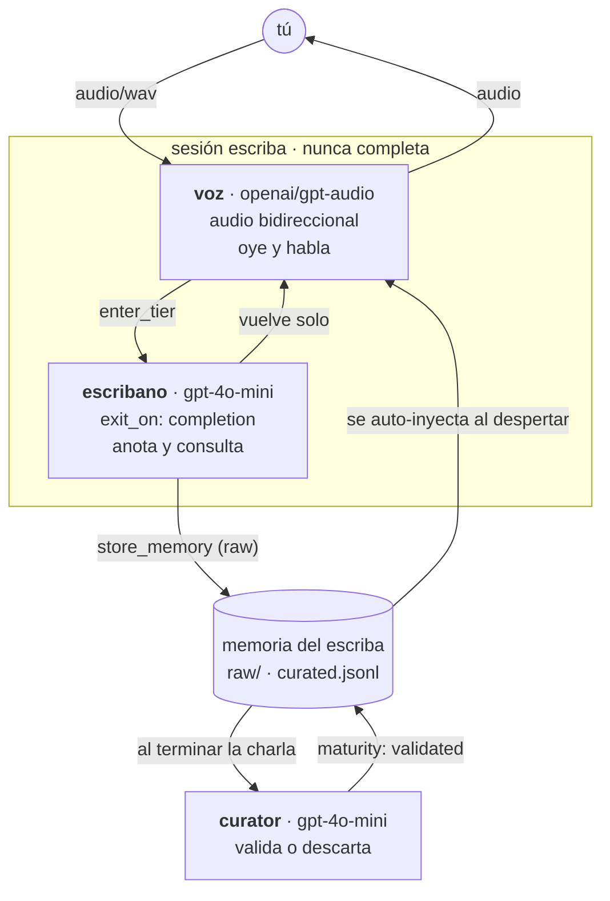
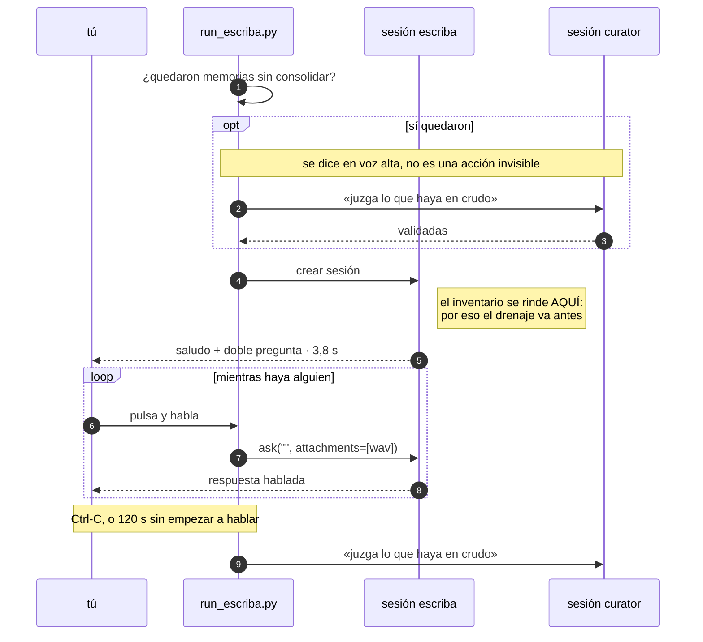
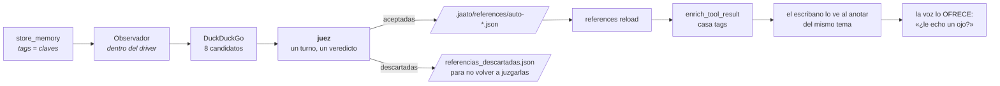

# jaato-escriba

**El segundo cerebro de una persona. Le pregunta en voz alta, y la
siguiente vez recuerda lo que le contó.**

```bash
python run_escriba.py
```

Pulsa para hablar. Se despide con Ctrl-C, y consolida al salir.

> **Estado.** La conversación funciona; la memoria todavía no se llena
> sola. El escriba conversa pero no entra en su tier de escritura, así
> que no llama a `store_memory` — medido: 0 llamadas en 5 turnos y 5,6
> minutos. Es [jaato#913](https://github.com/Jaato-framework-and-examples/jaato/issues/913).
> Todo lo que cuelga de esa llamada —la curación y el enriquecimiento con
> referencias— está construido y probado por separado, y está esperando.

---

## La forma



**Por qué dos tiers y no uno.** El esquema de herramientas es de toda la
sesión; lo que cambia el tier es qué modelo está al volante cuando se
decide llamarlas. Un modelo de audio ANUNCIA la herramienta en vez de
invocarla — medido en `jaato-cascade-audio-interchange`: dijo «voy a
abrir el parte» y no llamó a nada. Y cada nombre del esquema es una
palabra que puede leer en voz alta. Así que oye y habla uno, y escribe
otro.

**Por qué el curador es imprescindible.** Todo lo que el escriba anota
nace en CRUDO, y una memoria en crudo no la alcanza ninguna búsqueda por
tags ni se inyecta al despertar (`list_memory_tags`: *«pending_curation
… which no tag search can reach»*). Sin alguien que la promueva a
`validated`, el segundo cerebro no recuerda nada. El curador no es
limpieza: es lo que hace cierto el «recuerda».

**Por qué la conversación no declara `completion_payload_schema`.**
Declararlo habilita `signal_completion`, y llamarlo deja la sesión
quiescente. Una conversación no es un one-shot — y hoy es irreversible
por partida doble: [jaato#845](https://github.com/Jaato-framework-and-examples/jaato/issues/845)
(ni `session.wake` ni `inject_prompt` transportan un adjunto, así que a
una sesión multimodal terminada no se le puede volver a hablar) y
[jaato#913](https://github.com/Jaato-framework-and-examples/jaato/issues/913)
(la respuesta de `signal_completion` no se escribe en el historial, que
queda con un `tool_call` sin respuesta y lo rechaza el proveedor). La
sesión sigue viva y el driver vuelve a preguntar.

El **juez** sí declara esquema, y es lo correcto: es de un solo turno y
terminar es justo lo que tiene que hacer.

## Una conversación, de principio a fin



## Quién abre la conversación

La abre el driver, con una acotación — `[La sesión se abre…]` — y las
palabras las pone la persona. El escriba saluda y hace **dos preguntas a
la vez**, que es la única vez que le está permitido: si quieres enseñarle
algo nuevo, o si seguís con un tema concreto que **elige él** de lo que
ya sabe, nombrando qué le falta de ese tema.

Para poder elegirlo tiene que saber qué sabe al despertar, y ahí no vale
la inyección automática de memorias: `enrich_prompt` escoge las pistas
POR PALABRAS CLAVE del prompt (`memory/plugin.py:847-861`), y una
acotación no tiene ninguna. El inventario se calcula antes del primer
turno con un prefetch:

    .jaato/agents/escriba.md      {{!py:scripts/inventario.py}}
    .jaato/scripts/inventario.py  render(context, args) -> str

Corre en la preparación de la sesión, llega al plugin de memoria por
`context.registry` y rinde los temas con sus cuentas y su antigüedad. Sin
round-trip al modelo y **sin herramientas nuevas en el esquema**.

Aquí se cuenta lo CONTABLE —qué temas hay, cuántas piezas, cuándo se tocó
cada uno—. Cuál está flojo lo juzga el escriba, que es una valoración y
no una cuenta.

**El inventario es la lista completa de lo que sabe, y se lo dice así.**
Un ejemplo con contenido realista en la persona es munición para
confabular: la primera versión traía un saludo de muestra que hablaba de
hidroponía, y con el inventario vacío el modelo lo recitó y lo adornó
—«apunté que usas un sistema hidropónico, pero no sé qué nutrientes
añades»— inventándose la vida del usuario en su primera frase. Para un
segundo cerebro eso es la peor avería posible. Se arregló quitando el
ejemplo (la forma se describe en prosa, que no se puede recitar) y
poniendo la regla donde están los datos: cada rama del prefetch enuncia
la suya.

## Lo que encuentra fuera



El reparto de siempre: **buscar y escribir el catálogo es mecánico** y se
hace en Python; **decidir si un resultado vale es un juicio** y lo hace el
juez. El JSON del catálogo no se le pide al modelo — un LLM redactando
ficheros de configuración inventa campos y se deja llaves.

**El veredicto son dos listas**, aceptadas y descartadas, y un procesador
de completion cuadra cada URL contra las que se pasaron: cada una en una
lista y solo en una, ninguna inventada. Sin ese gate la respuesta más
barata es rendir dos aceptadas y callar sobre el resto — valida igual y
parece trabajo hecho. Y las descartadas no son papeleo: son lo que impide
volver a juzgar la misma URL mañana.

**Cómo llega la referencia al escriba.** Por el propio plugin:
`references` implementa `enrich_tool_result`, que casa tags contra el
resultado de las herramientas, y el resultado de `store_memory` lleva los
tags. NO por `enrich_prompt`, que casa contra las palabras del prompt y
en un turno hablado el prompt va vacío: la pregunta es el adjunto.

**Y hay que recargar el catálogo tras escribirlo.** Se lee al arrancar
(`set_workspace_path` → `_reload_catalog`) y luego se queda quieto.
Medido: 7 referencias antes de escribir la octava, 7 después, y 8 solo
tras `execute_command("references", ["reload"])`. Sin eso, lo que se
encuentra hoy no se ofrece hasta la conversación siguiente.

El escriba **ofrece, no usa**: una cosa por respuesta, al final, y nunca
lee una URL en voz alta —«un artículo de Martin Fowler», no la
dirección—. Si dices que sí, entra en `escribano` y la selecciona.

> Los candidatos se juzgan por título y fragmento; nadie los abre. Una
> URL catalogada puede haber caducado.

## Arranque

Se saluda a los **3,8 s**: 1,6 s de crear la sesión y 2,2 s de lo que el
modelo de audio tarda en soltar el primer byte.

Eran 8,8 s, y el 64 % se iba en el curador — 1,6 s en abrir su sesión y
4,0 s en un drenaje de apertura que **no podía servir para nada**, porque
el inventario se rinde al CREAR la sesión del escriba, antes de que el
curador promueva nada.

Ahora ese drenaje solo se paga **si hay algo que juzgar**, y entonces sí
sirve, porque va por delante del inventario:

    · quedaron 2 memorias sin consolidar de la última vez — las juzgo antes de empezar
    · consolidado; ya puedo empezar sabiéndolo

La condición se cuenta del almacén en crudo (`memoria.py`) y no de una
bandera de «la última sesión terminó bien»: una bandera hay que
escribirla al abrir y borrarla al cerrar, y un `kill -9` entre medias la
deja mintiendo. Las memorias en crudo SON la condición — y cogen además
el caso que la bandera no ve, que una sesión limpia deje cola porque el
curador juzga de ocho en ocho.

## Cómo se termina

**Ctrl-C** es la despedida normal, y consolida antes de salir.

El plazo de silencio (`SILENCIO_S`, 120 s) es la red de seguridad para
cuando alguien se levanta y se va. Mide **abandono, no duración**:
mientras la tecla esté pulsada se reinicia, así que una explicación larga
no lo agota nunca.

Contarlo de otra manera fue un fallo real. Una intervención se entrega
cuando se SUELTA la tecla, no cuando se empieza a hablar
(`ptt_capture.py:426-432`), así que un único `wait_for` sobre la cola
mide «cuánto tardas en terminar de hablar». Quien se paraba diez segundos
a pensar y explicaba cuarenta entregaba a los cincuenta, y con el plazo
en cuarenta y cinco la conversación se cerraba MIENTRAS seguía hablando.
`Ears.escuchar` mira ahora si hay pulsación abierta —o un corte cerrado
todavía sin entregar— y reinicia el plazo en vez de rendirse.

## Los ficheros

| | |
|---|---|
| `run_escriba.py` | El driver. Todo el SDK son dos sesiones y tres `ask`. |
| `voice.py` | Oídos y boca: el puente hilo↔asyncio y el sumidero de audio. |
| `memoria.py` | Qué quedó sin consolidar de la última vez. |
| `referencias.py` | Buscar, juzgar y catalogar lo de fuera. |
| `ptt_capture.py`, `pulse_playback.py` | Copiados sin tocar de `jaato-cascade-audio-interchange`. No saben nada de jaato. |
| `.jaato/agents/*.md` | Las tres personas: escriba, curator, juez. |
| `.jaato/profiles/` | `_base_*` agnóstico + set `openrouter_gpt_audio`. |

Todo lo que no es SDK vive fuera del driver a propósito: `run_escriba.py`
debe leerse como lo que quiere demostrar.

## Lo que el SDK se lleva

`IPCClient.session()` conecta, configura y crea la sesión. `Session.ask`
es dueño de la receta de enviar-y-esperar (`first-of {TURN_COMPLETED,
SESSION_TERMINATED}`), así que un turno no puede colgarse aquí.
Suscribirse a eventos, contar terminales y desuscribirse no aparece en
este repo porque no es del que escribe el driver.

`ask` y no `complete`: **una llamada es un TURNO**, y la conversación es
el bucle que la repite sobre la MISMA sesión. `complete` espera a que la
sesión TERMINE — correcto para el juez, fatal para una charla.

La simetría que hace posible hablar: `ask` devuelve lo que el modelo
ESCRIBIÓ y `on_media` entrega lo que DIJO, según suena. El audio del
usuario entra por `attachments`, y en un turno hablado el prompt va
VACÍO — la pregunta ES el adjunto.

## Incidente del 2026-09-09 — leer antes de tocar los permisos

En su primer arranque el curador **borró tres memorias reales del
usuario**, dos personales, con 22 y 18 usos. Se recuperaron íntegras del
journal de la sesión, que es suerte y no diseño.

Dos causas, ambas estructurales:

1. **`delete_memory` estaba en la lista blanca**, y la persona decía
   «prefiere descartar a borrar». La prosa es una sugerencia; la lista
   blanca es el contrato. Al re-probar con la herramienta retirada, el
   modelo **volvió a intentar borrar** y fue denegado — que es la prueba
   de cuál de las dos capas manda.
2. **`allowed_scopes: ["project"]` no aislaba nada.** Es un *write-side
   gate*: se aplica solo al almacenar (`memory/plugin.py:1064`).
   `retrieve_memories` y `delete_memory` no lo consultan, y el nivel
   global apunta por defecto a `~/.jaato/memories.jsonl` — el almacén de
   toda la máquina.

Arreglado retirando `delete_memory` del whitelist y redirigiendo
`global_storage_path` al workspace.

**La lista blanca no es una frontera.** Un plugin puede marcar
herramientas como auto-aprobadas, y esas se saltan la política: `memory`
lo hace con `store_memory` (`plugin.py:740`) y `references` con las
cuatro suyas (`plugin.py:4356`). `delete_memory` quedaba fuera solo
porque no está en esa lista — suerte, no diseño. **La frontera de verdad
es `tools:[...]` en `plugins:`**, que deja la herramienta fuera del
registro. Ha mordido tres veces en este repo.

Corolario, del mismo día: con `store_memory` a mano, el curador descartó
una memoria buena y la volvió a guardar en crudo con `content` y
`description` intercambiados — cada drenaje la descartaba y la recreaba,
así que no se validaba nunca. Ahora el curador no puede escribir ni
borrar: juzga lo que ya está escrito.

## Procedencia — verificado contra el framework INSTALADO

Buena parte del diseño viene de `jaato-cascade-audio-interchange`, cuyo
`KNOWN_ISSUES.md` es una foto contra un servidor más viejo. Contra el
0.7.0 instalado:

| | estado real en 0.7.0 |
|---|---|
| **#822** tier sin `model`/`provider` arriba no arranca | **ARREGLADO.** `runner_spawn.py:455-464` documenta la cadena `profile.provider → model_tiers[initial].provider → JAATO_PROVIDER`. Comprobado: este perfil, solo-tiers, crea sesión en 1,5 s. |
| **#845** ni `wake` ni `inject_prompt` llevan adjunto | **SIGUE VIVO.** `inject_prompt(text, source_type, source_id, timeout)`; `command_router.py` no menciona adjuntos. |
| **#913** la respuesta de `signal_completion` no llega al historial | **ABIERTO**, encontrado aquí. `jaato_session.py:5992` corta el turno y se salta la continuación que la escribiría; el historial queda con un `tool_call` sin respuesta y el proveedor lo rechaza con un 400. |
| **#912** `storage_path` `.jsonl` se reinterpreta como directorio | **ABIERTO**, encontrado aquí. |

No verificado, heredado de aquel repo: que `temperature: 0.0` hace bucle
en gpt-audio (818 s medidos) y que el `-mini` no sale del seseo. Son
medidas de comportamiento del modelo, no del framework.

## Requisitos

`parec`, `paplay`, `pactl`, `pw-metadata`, un daemon jaato en
`/tmp/jaato.sock`, y credencial de OpenRouter en
`~/.jaato/openrouter_auth.json` (`openrouter-auth`). El micrófono es el
`wraith_mic` de `ptt_capture.py`.
