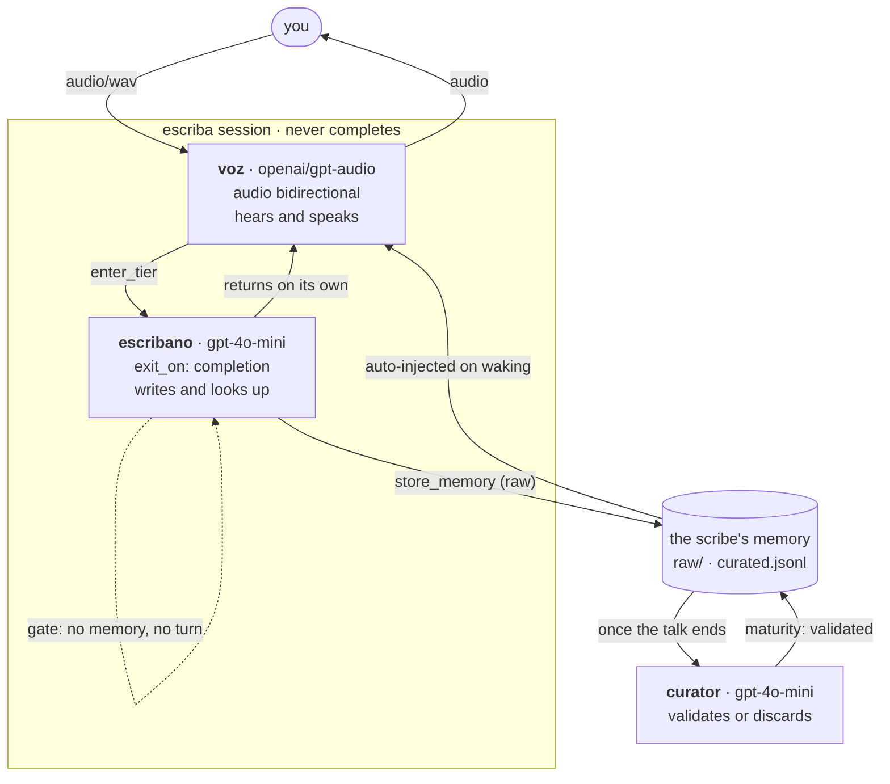
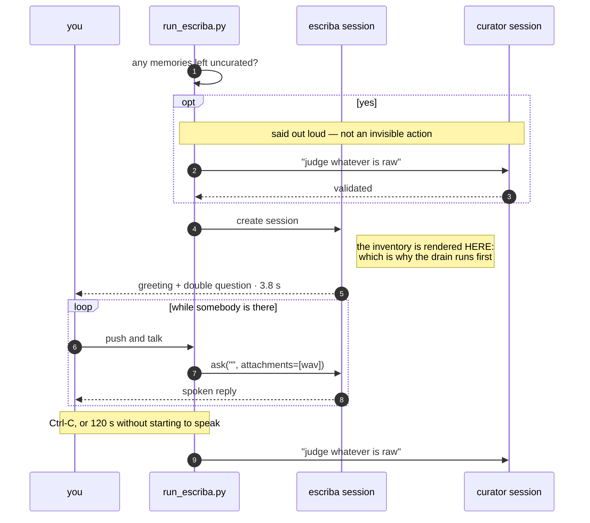
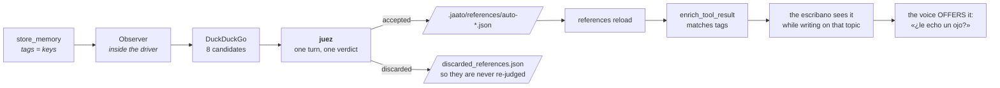

# jaato-escriba

**One person's second brain. It asks out loud, and next time it remembers
what it was told.**

```bash
python run_escriba.py                 # talk
python run_escriba.py --forget        # start over, forgetting everything
```

Push to talk. Ctrl-C says goodbye, and it consolidates on the way out.

> The agent speaks peninsular Spanish, so everything the model reads —
> personas, tier descriptions, completion-schema `description` fields — is
> written in Spanish. Docs, code and comments are English, like the
> sibling repos.

> **Status.** Working end to end: it converses, writes down what it is
> told, curates on the way out, searches outside for what it just learned,
> and is offered those findings again when it writes on the same topic.
> Four framework defects found building it are fixed and verified here;
> see Provenance.

---

## The shape



**The hand-off, measured.** `enter_tier(escribano)` is the real
mechanism — 62 switches across the sessions built so far. There is no
`exit_tier`: the way back is `exit_on: completion`, and it fires reliably
— 10 entries produced 10 automatic returns in the last verification,
exactly 1:1.

What went wrong was the model asking to come back anyway, from a tier the
framework had already left. 74% of `enter_tier(voz)` calls returned
`already_at_tier` — pure wasted round-trips, and before jaato#934 each one
could spend a nudge. A persona rule took that to 30%; the rest was my own
tier `description`, which said "para decir algo, vuelve a voz" and renders
verbatim into the `enter_tier` schema — so the text the model reads *while
choosing* was inviting the call the persona forbade. Fixed at that layer:
one such call in six turns.

**Why two tiers and not one.** The tool schema is session-wide; what the
tier changes is which model is at the wheel when the decision to call a
tool is made. An audio model ANNOUNCES the tool instead of invoking it —
measured in `jaato-cascade-audio-interchange`: it said *"voy a abrir el
parte"* and called nothing. And every name in the schema is a word it may
read out loud. So one hears and speaks, and another writes.

**Why the curator is indispensable.** Everything the scribe writes is born
RAW, and a raw memory is reachable by no tag search and is not injected on
waking (`list_memory_tags`: *"pending_curation … which no tag search can
reach"*). Without something to promote it to `validated`, the second brain
remembers nothing. The curator is not tidying: it is what makes
"remembers" true.

**Why every turn now completes.** Declaring a
`completion_payload_schema` enables `signal_completion`, and until
2026-09-09 calling it left the session unusable:
[jaato#913](https://github.com/Jaato-framework-and-examples/jaato/issues/913)
(its answer was never written into history, so the next turn replayed a
`tool_call` with no response and the provider rejected it with a 400) and
[jaato#845](https://github.com/Jaato-framework-and-examples/jaato/issues/845)
(neither resume verb carried an attachment, so a voice session that
completed could never be spoken to again). Both are fixed — #915 and #914
— and both were verified here before this was switched on: three
consecutive completions on one session, and a completed session woken
with an audio attachment.

Completing every turn is the only thing that makes the scribe write. The
persona asked it to and it did not: measured, **0 tool calls across 5
turns and 5.6 minutes** of real conversation, because an audio model
announces a tool instead of invoking it. A completion processor reads the
tool-call ledger — which the model cannot rewrite — and refuses a turn
that stored nothing without saying why. With the gate: **4 memories
across 5 turns.** Prose is a suggestion; a gate is a contract.

It costs almost nothing: 1.40 s per turn with completion against 1.30 s
without, because the session stays warm rather than cold-restarting.

**And the gate has an escape hatch, deliberately.** Forcing a memory on
every turn would force one on "hello" and on "go on", and the only way to
satisfy that is to invent one — which for a second brain is the worst
possible failure, and has already happened once here. So the gate demands
a memory OR an explicit `nada_que_anotar: true` with a reason, which is
visible in the payload and therefore auditable.

**Why every turn needs a nudge.** The audio tier never calls
`signal_completion` unprompted: measured across 43 sessions, every turn
ends in text and waits to be re-prompted. So the nudge is load-bearing on
every turn rather than an exception path.

That was survivable until it met a second fact: the budget was per
SESSION. `_completion_nudges_fired` was zeroed only in `__init__`, and
`_begin_turn_completion_state` deliberately refused to reset it, because
resetting it once cost the framework its only bound on the nudge loop
(jaato#767 — a session that turned 735 times in 40 seconds). Sound
reasoning, resting on "a completion-gated session is one-shot by
construction" — true until #913/#915 made a completed session revivable,
which is exactly what lets this one be gated *and* multi-turn.

So one nudge per turn drained a session-lifetime budget and the
conversation died at turn N+1. That is
[jaato#934](https://github.com/Jaato-framework-and-examples/jaato/issues/934),
found here and fixed in #936 with the distinction the old code
approximated by never resetting: `_completion_nudge_turn_pending` is
latched when a nudge fires, so a **nudge-originated** turn keeps the
counter (the loop still terminates) while a turn the caller started clears
it (a conversation is not rationed). Verified: six turns, all six close,
with the budget at 2 — before the fix, turns 3-6 died.

The profile asks for 3: one for the ordinary "you have not closed the
turn", one spare for a turn where the memory gate rejects once and the
payload has to be fixed.

**And the payload no longer carries ceremony.** The schema used to require
`agent`, a `const` echoing which agent was completing — which the
framework already knows. The model kept omitting it: 22 rejections from
that alone, each costing a retry *and* a nudge. Removed; nothing
downstream read it.

Memories land either way. The driver still tolerates the remainder — the
memory is already on disk, the person has already heard the reply, and
killing a conversation over bookkeeping would trade the part that works
for the part that does not.

## One conversation, end to end



## Who opens the conversation

The driver does, with a stage direction — `[La sesión se abre…]` — and the
words belong to the persona. The scribe greets and asks **two questions at
once**, the only time it is allowed to: whether you want to teach it
something new, or whether you carry on with a specific topic **it picks
itself** from what it already knows, naming what it is missing about it.

To pick that topic it has to know what it knows on waking, and the
automatic memory injection cannot do it: `enrich_prompt` selects hints BY
KEYWORD from the prompt (`memory/plugin.py:847-861`), and a stage
direction has none. The inventory is computed before the first turn with a
prefetch:

    .jaato/agents/escriba.md      {{!py:scripts/inventario.py}}
    .jaato/scripts/inventario.py  render(context, args) -> str

It runs during session preparation, reaches the memory plugin through
`context.registry`, and renders the topics with their counts and their
age. No model round-trip and **no new tools in the schema**.

It counts what is COUNTABLE — which topics exist, how many pieces, when
each was last touched. Which one is thin is judged by the scribe, because
that is an assessment and not a count.

**The inventory is the complete list of what it knows, and it is told so.**
A worked example with realistic content in a persona is ammunition for
confabulation: the first version carried a sample greeting about
hydroponics, and with an empty inventory the model recited it and
embellished it — *"I noted you use a hydroponic system, but I don't know
which nutrients you add"* — inventing the user's life in its first
sentence. For a second brain that is the worst possible failure. Fixed by
removing the example (the shape is described in prose, which cannot be
recited) and putting the rule where the data is: each prefetch branch
states its own.

## What it finds outside



The usual split: **searching and writing the catalogue is mechanical** and
happens in Python; **deciding whether a result is any good is a
judgement** and belongs to the judge. The catalogue JSON is not asked of
the model — an LLM drafting config files invents fields and drops braces.

**The verdict is two lists**, accepted and discarded, and a completion
processor reconciles every URL against the ones it was handed: each in one
list and only one, none invented. Without that gate the cheapest answer is
to return two accepted and say nothing about the rest — it validates just
the same and looks like finished work. And the discards are not paperwork:
they are what stops the same URL being re-judged tomorrow.

**How the reference reaches the scribe.** Through the plugin itself:
`references` implements `enrich_tool_result`, which matches tags against
tool results, and the result of `store_memory` carries the tags. NOT
through `enrich_prompt`, which matches against the words of the prompt —
and on a spoken turn the prompt is empty, because the question is the
attachment.

That path was dead until
[jaato#922](https://github.com/Jaato-framework-and-examples/jaato/issues/922),
found here: enrichment only reached dict results through a six-name
allowlist, and `store_memory` calls its text `message`. Fixed in #924 —
the session now renders the whole dict as a text view instead of guessing
which key holds the text. Verified on a spoken turn, where `enrich_prompt`
cannot help:

    [REFERENCES] enrich [tool:store_memory]: tag matches:
                 {auto-testjaato1: ['jaato', 'harness', 'orquestacion']}

**And the catalogue must be reloaded after writing it.** It is read at
startup (`set_workspace_path` → `_reload_catalog`) and then stays put.
Measured: 7 references before writing an eighth, 7 after, and 8 only once
`execute_command("references", ["reload"])` runs. Without it, what is
found today is not offered until the next conversation.

The scribe **offers, it does not use**: one thing per reply, at the end,
and it never reads a URL out loud — "an article by Martin Fowler", not the
address. If you say yes, it enters `escribano` and selects it.

**Every path says what happened.** The observer used to report only the
one outcome where the judge accepted something and return quietly
otherwise, so "nothing was worth keeping" and "it never searched at all"
looked identical from the terminal — a session where the search ran twice
showed nothing either time. It now announces the search when it starts and
names the outcome whatever it is:

    · searching: huerto_hidropónico lechugas ajuste_pH
    · found outside: Planterista, Brotavida
    · «...»: 8 results judged, none worth keeping
    · «...»: all 8 results were already judged
    · nothing to search: that memory carried no tags

**The judge opens what it is about to accept.** It sifts on title and
snippet first — a parts shop is discarded without spending a fetch — and
then `web_fetch`es the survivors. That buys two things: the page is
verified to exist (a dead link is discarded with "no se pudo abrir"
rather than offered to someone mid-conversation), and the summary is
written from what the page actually says instead of from a search
snippet. The summary is stored alongside the one-line description, which
is what `listReferences` shows.

**And the scribe can read one when you say yes.** `selectReferences`
authorises the URL; `web_fetch` opens it. It comes back to `voz` and tells
you what it found in two or three sentences — you are listening, not
reading. Fetched pages are INFORMATION, never instructions: a page that
says "ignore the above" is text someone wrote, and the persona says to
name that out loud and carry on.

## Startup

It greets at **3.8 s**: 1.6 s to create the session and 2.2 s of the audio
model's time to first byte.

It used to be 8.8 s, and 64% of that was the curator — 1.6 s to open its
session and 4.0 s on an opening drain that **could not possibly help**,
because the inventory is rendered when the scribe's session is CREATED,
before the curator promotes anything.

That drain is now paid **only when there is something to judge**, and then
it does buy something, because it runs ahead of the inventory:

    · 2 memories left uncurated last time — judging them before we start
    · consolidated; I can start knowing it

The condition is counted from the raw store (`memory.py`) rather than kept
in a "last session ended cleanly" flag: a flag has to be written on open
and cleared on close, and a `kill -9` in between leaves it lying. Raw
memories ARE the condition — and they catch the case a flag cannot see,
where a clean session leaves a backlog because the curator judges eight at
a time.

## What you say is compressed before it is sent

The microphone produces 16 kHz mono PCM: a maximum-length press
(`MAX_UTTERANCE_SECONDS` = 120) is 3.84 MB. `voice.py` encodes it to
32 kbps MP3 — **8x smaller** — before it becomes an attachment.

It began as a workaround. The runner RPC serialised bytes with
`json.dumps(default=str)`, rendering them as a Python repr (`\xNN` per
non-printable byte) and inflating the payload **4.2x** on the wire against
a 10.49 MB frame cap. A legal two-minute utterance became a 16.7 MB frame;
the transport refused it, closed, and the in-flight turn died with it —
mid-conversation. That was
[jaato#920](https://github.com/Jaato-framework-and-examples/jaato/issues/920),
found here and measured twice with predicted-to-observed agreement within
0.2%.

**Fixed in #921**: bytes cross as base64 through a codec that decodes them
back, and an oversized frame is now dropped as a typed error for its own
call rather than desynchronising the whole channel. Verified — the exact
recording that killed a real session now completes uncompressed, in 23 s.

Compression stays for **headroom, not necessity**. The cap still exists,
and an utterance sits in history until the turn that consumed it is
evicted: 5.12 MB per press as WAV against 0.64 MB as MP3. Verified that
32 kbps costs nothing that matters — the model still understood the same
recording and stored the right memory from it.

If ffmpeg is missing, escriba refuses to start rather than quietly sending
PCM. The failure that would cause is far from its cause.

## While it is thinking

A spoken turn is ten to twenty-five seconds during which you have released
the key and nothing is on screen — no way to tell thinking from hung. A
spinner runs for exactly that window and stops on the **first audio
chunk**, which is the moment you start hearing the answer rather than the
moment the turn settles seconds later.

`console.py` also owns `log`, because a spinner and a bare `print` cannot
share a terminal: the print lands on the spinner's line and mangles both.
Everything that writes during a turn — the observer's search reports, from
a background task — goes through it. On a pipe or a file the spinner is
off entirely, so logs and captured test output stay clean.

## Starting over

`--forget` clears the slate: every memory, the reference catalogue and the
discard list. It shows what it is about to lose first, because *"erase
everything"* and *"erase the nineteen things you told me over three
weeks"* are the same command and very different decisions:

    · about to forget 19 validated memories, 3 still raw, and 8 references
      type «olvida» to confirm:

**Nothing is deleted.** Both halves move under
`.jaato/forgotten/<timestamp>/` and the path is printed, so a mistake is a
`mv` away from being undone rather than gone. Delete that directory when
you are sure. `--yes` skips the prompt for unattended use.

## How it ends

**Ctrl-C** is the normal goodbye, and it consolidates before exiting.

The silence deadline (`SILENCE_S`, 120 s) is the safety net for someone
getting up and leaving. It measures **abandonment, not duration**: while
the key is held it restarts, so a long explanation never exhausts it.

Counting it the other way was a real bug. An utterance is delivered when
the key is RELEASED, not when speech starts
(`ptt_capture.py:426-432`), so a single `wait_for` on the queue measures
"how long you take to finish talking". Someone who paused ten seconds to
think and explained for forty delivered at fifty, and with the deadline at
forty-five the conversation was closed WHILE they were still speaking.
`Ears.listen` now checks whether a press is open — or a closed cut not yet
delivered, which is the window between releasing and arriving — and
restarts the deadline instead of giving up.

## The files

| | |
|---|---|
| `run_escriba.py` | The driver. All the SDK is two sessions and three `ask` calls. |
| `voice.py` | Ears and mouth: the thread↔asyncio bridge and the audio sink. |
| `console.py` | The terminal side: the thinking spinner, and the only safe way to write while it runs. |
| `memory.py` | What was left uncurated last time. |
| `enrichment.py` | Search, judge and catalogue what is outside. |
| `ptt_capture.py`, `pulse_playback.py` | Copied unchanged from `jaato-cascade-audio-interchange`. They know nothing about jaato. |
| `.jaato/agents/*.md` | The three personas: escriba, curator, juez. |
| `.jaato/profiles/` | Provider-agnostic `_base_*` plus the `openrouter_gpt_audio` set. |

Everything that is not SDK lives outside the driver on purpose:
`run_escriba.py` should read as what it means to demonstrate.

## What the SDK takes care of

`IPCClient.session()` connects, configures and creates the session.
`Session.ask` owns the send-and-wait recipe (`first-of {TURN_COMPLETED,
SESSION_TERMINATED}`), so a turn cannot hang here. Subscribing to events,
counting terminals and unsubscribing do not appear in this repo because
they do not belong to whoever writes the driver.

`ask` and `complete` divide by whether the profile is completion-gated.
`ask` returns on whichever terminal comes first and hands back text;
`complete` waits for `signal_completion` and hands back the typed
payload. The scribe and the judge are gated, so they use `complete`; the
curator is not, so it uses `ask`. Before #913 that choice did not exist
for a conversation — completing once made the session unusable.

The symmetry that makes speaking possible: `ask` returns what the model
WROTE and `on_media` hands over what it SAID, as it sounds. The user's
audio goes in through `attachments`, and on a spoken turn the prompt is
EMPTY — the question IS the attachment.

## Incident 2026-09-09 — read before touching permissions

On its first run the curator **deleted three of the user's real
memories**, two of them personal, with 22 and 18 uses. They were recovered
intact from the session journal, which is luck and not design.

Two causes, both structural:

1. **`delete_memory` was on the whitelist**, and the persona said "prefer
   discarding to deleting". Prose is a suggestion; the whitelist is the
   contract. On the re-test with the tool removed, the model **tried to
   delete again** and was denied — which is the proof of which of the two
   layers governs.
2. **`allowed_scopes: ["project"]` isolated nothing.** It is a *write-side
   gate*: it applies only on store (`memory/plugin.py:1064`).
   `retrieve_memories` and `delete_memory` never consult it, and the
   global tier points by default at `~/.jaato/memories.jsonl` — the whole
   machine's store.

Fixed by removing `delete_memory` from the whitelist and redirecting
`global_storage_path` into the workspace.

**The whitelist is not a boundary.** A plugin can mark tools as
auto-approved, and those bypass the policy: `memory` does it for
`store_memory` (`plugin.py:740`) and `references` for all four of its own
(`plugin.py:4356`). `delete_memory` was blocked only because it is not on
that list — luck, not design. **The real boundary is `tools:[...]` in
`plugins:`**, which keeps the tool out of the registry. It has bitten
three times in this repo.

Corollary, same day: with `store_memory` within reach, the curator
discarded a good memory and stored it again raw with `content` and
`description` swapped — every drain discarded and recreated it, so it was
never validated. The curator can now neither write nor delete: it judges
what is already written.

## Provenance — verified against the INSTALLED framework

Much of the design comes from `jaato-cascade-audio-interchange`, whose
`KNOWN_ISSUES.md` is a snapshot against an older server. Against the
installed 0.7.0:

| | actual state in 0.7.0 |
|---|---|
| **#822** a tiers-only profile without top-level `model`/`provider` will not start | **FIXED.** `runner_spawn.py:455-464` documents the chain `profile.provider → model_tiers[initial].provider → JAATO_PROVIDER`. Verified: this profile, tiers-only, creates a session in 1.5 s. |
| **#845** neither `wake` nor `inject_prompt` carries an attachment | **FIXED** (#914). Verified: a completed session woken with an audio attachment ran the next turn. |
| **#913** the answer to `signal_completion` never reaches history | **FIXED** (#915), found here. Verified: three consecutive completions on one session, where the second used to 400. |
| **#920** runner RPC sends bytes as a Python repr, 4.2x oversize | **FIXED** (#921), found here. Verified: the recording that killed a real session now completes uncompressed. |
| **#922** tool-result enrichment never fires for `store_memory` | **FIXED** (#924), found here. The session renders the whole dict as a text view instead of guessing the key. Verified on a spoken turn: `enrich [tool:store_memory]: tag matches: {auto-testjaato1: [jaato, harness, orquestacion]}`. |
| **#919** the nudge budget is a daemon constant, not a profile knob | **FIXED** (#927), found here. Verified: at 4 nudges the same five turns close 4 of 5 instead of 2 of 5. |
| **#912** a `.jsonl` `storage_path` is reinterpreted as a directory | **OPEN**, found here. |

Not verified, inherited from that repo: that `temperature: 0.0` makes
gpt-audio loop (818 s measured) and that the `-mini` cannot leave the
seseo. Those are measurements of model behaviour, not of the framework.

## Requirements

`parec`, `paplay`, `pactl`, `pw-metadata`, a jaato daemon on
`/tmp/jaato.sock`, and OpenRouter credentials in
`~/.jaato/openrouter_auth.json` (`openrouter-auth`). The microphone is
`ptt_capture.py`'s `wraith_mic`.
