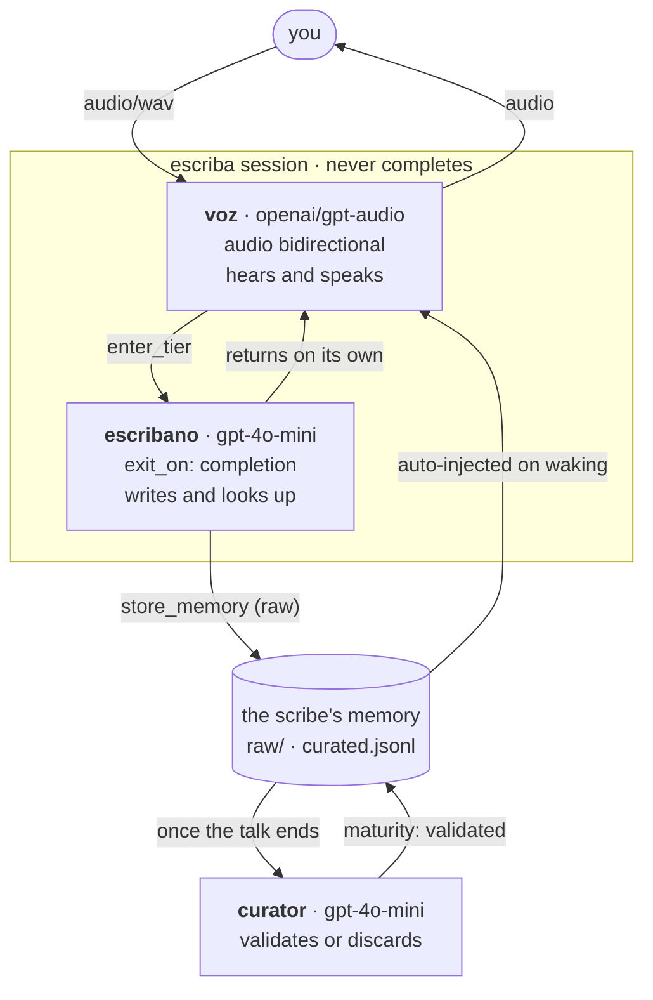
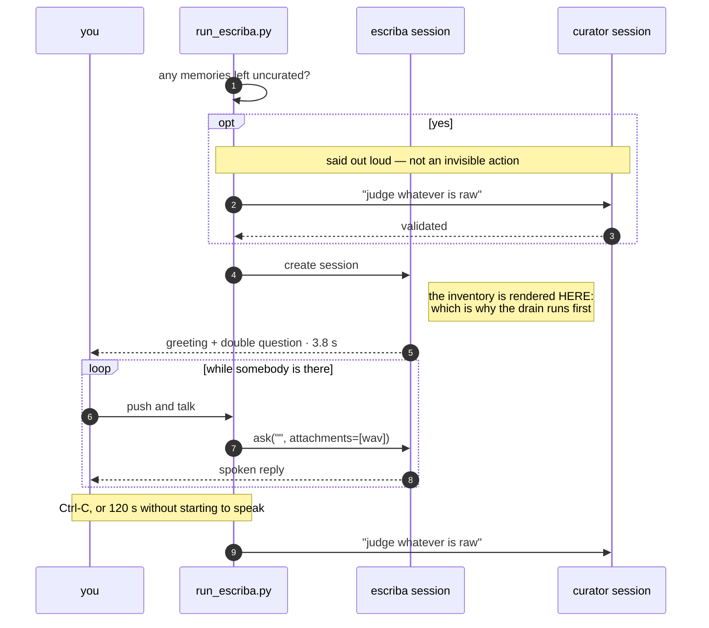
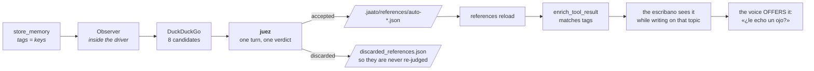

# jaato-escriba

**One person's second brain. It asks out loud, and next time it remembers
what it was told.**

```bash
python run_escriba.py
```

Push to talk. Ctrl-C says goodbye, and it consolidates on the way out.

> The agent speaks peninsular Spanish, so everything the model reads —
> personas, tier descriptions, completion-schema `description` fields — is
> written in Spanish. Docs, code and comments are English, like the
> sibling repos.

> **Status.** The conversation works; memory does not fill itself yet. The
> scribe converses but never enters its writing tier, so it never calls
> `store_memory` — measured: 0 calls across 5 turns and 5.6 minutes. That
> is [jaato#913](https://github.com/Jaato-framework-and-examples/jaato/issues/913).
> Everything hanging off that call — curation and reference enrichment —
> is built and tested in isolation, and waiting.

---

## The shape



**Why two tiers and not one.** The tool schema is session-wide; what the
tier changes is which model is at the wheel when the decision to call a
tool is made. An audio model ANNOUNCES the tool instead of invoking it —
measured in `jaato-cascade-audio-interchange`: it said *"voy a abrir el
parte"* and called nothing. And every name in the schema is a word it may
read out loud. So one hears and speaks, and another writes.

**Why the curator is indispensable.** Everything the scribe writes is born
RAW, and a raw memory is reachable by no tag search and is not injected on
waking (`list_memory_tags`: *"pending_curation … which no tag search can
reach"*). Without something to promote it to `validated`, the second brain
remembers nothing. The curator is not tidying: it is what makes
"remembers" true.

**Why the conversation declares no `completion_payload_schema`.**
Declaring it enables `signal_completion`, and calling it leaves the
session quiescent. A conversation is not a one-shot — and today it is
irreversible twice over:
[jaato#845](https://github.com/Jaato-framework-and-examples/jaato/issues/845)
(neither `session.wake` nor `inject_prompt` carries an attachment, so a
multimodal session that ended can never be spoken to again) and
[jaato#913](https://github.com/Jaato-framework-and-examples/jaato/issues/913)
(the answer to `signal_completion` is never written into history, which is
left holding a `tool_call` with no response, and the provider rejects it).
The session simply stays alive and the driver asks again.

The **judge** does declare a schema, and that is right: it is single-turn,
and terminating is exactly its job.

## One conversation, end to end



## Who opens the conversation

The driver does, with a stage direction — `[La sesión se abre…]` — and the
words belong to the persona. The scribe greets and asks **two questions at
once**, the only time it is allowed to: whether you want to teach it
something new, or whether you carry on with a specific topic **it picks
itself** from what it already knows, naming what it is missing about it.

To pick that topic it has to know what it knows on waking, and the
automatic memory injection cannot do it: `enrich_prompt` selects hints BY
KEYWORD from the prompt (`memory/plugin.py:847-861`), and a stage
direction has none. The inventory is computed before the first turn with a
prefetch:

    .jaato/agents/escriba.md      {{!py:scripts/inventario.py}}
    .jaato/scripts/inventario.py  render(context, args) -> str

It runs during session preparation, reaches the memory plugin through
`context.registry`, and renders the topics with their counts and their
age. No model round-trip and **no new tools in the schema**.

It counts what is COUNTABLE — which topics exist, how many pieces, when
each was last touched. Which one is thin is judged by the scribe, because
that is an assessment and not a count.

**The inventory is the complete list of what it knows, and it is told so.**
A worked example with realistic content in a persona is ammunition for
confabulation: the first version carried a sample greeting about
hydroponics, and with an empty inventory the model recited it and
embellished it — *"I noted you use a hydroponic system, but I don't know
which nutrients you add"* — inventing the user's life in its first
sentence. For a second brain that is the worst possible failure. Fixed by
removing the example (the shape is described in prose, which cannot be
recited) and putting the rule where the data is: each prefetch branch
states its own.

## What it finds outside



The usual split: **searching and writing the catalogue is mechanical** and
happens in Python; **deciding whether a result is any good is a
judgement** and belongs to the judge. The catalogue JSON is not asked of
the model — an LLM drafting config files invents fields and drops braces.

**The verdict is two lists**, accepted and discarded, and a completion
processor reconciles every URL against the ones it was handed: each in one
list and only one, none invented. Without that gate the cheapest answer is
to return two accepted and say nothing about the rest — it validates just
the same and looks like finished work. And the discards are not paperwork:
they are what stops the same URL being re-judged tomorrow.

**How the reference reaches the scribe.** Through the plugin itself:
`references` implements `enrich_tool_result`, which matches tags against
tool results, and the result of `store_memory` carries the tags. NOT
through `enrich_prompt`, which matches against the words of the prompt —
and on a spoken turn the prompt is empty, because the question is the
attachment.

**And the catalogue must be reloaded after writing it.** It is read at
startup (`set_workspace_path` → `_reload_catalog`) and then stays put.
Measured: 7 references before writing an eighth, 7 after, and 8 only once
`execute_command("references", ["reload"])` runs. Without it, what is
found today is not offered until the next conversation.

The scribe **offers, it does not use**: one thing per reply, at the end,
and it never reads a URL out loud — "an article by Martin Fowler", not the
address. If you say yes, it enters `escribano` and selects it.

> Candidates are judged from title and snippet; nothing opens them. A
> catalogued URL may have gone stale.

## Startup

It greets at **3.8 s**: 1.6 s to create the session and 2.2 s of the audio
model's time to first byte.

It used to be 8.8 s, and 64% of that was the curator — 1.6 s to open its
session and 4.0 s on an opening drain that **could not possibly help**,
because the inventory is rendered when the scribe's session is CREATED,
before the curator promotes anything.

That drain is now paid **only when there is something to judge**, and then
it does buy something, because it runs ahead of the inventory:

    · 2 memories left uncurated last time — judging them before we start
    · consolidated; I can start knowing it

The condition is counted from the raw store (`memory.py`) rather than kept
in a "last session ended cleanly" flag: a flag has to be written on open
and cleared on close, and a `kill -9` in between leaves it lying. Raw
memories ARE the condition — and they catch the case a flag cannot see,
where a clean session leaves a backlog because the curator judges eight at
a time.

## How it ends

**Ctrl-C** is the normal goodbye, and it consolidates before exiting.

The silence deadline (`SILENCE_S`, 120 s) is the safety net for someone
getting up and leaving. It measures **abandonment, not duration**: while
the key is held it restarts, so a long explanation never exhausts it.

Counting it the other way was a real bug. An utterance is delivered when
the key is RELEASED, not when speech starts
(`ptt_capture.py:426-432`), so a single `wait_for` on the queue measures
"how long you take to finish talking". Someone who paused ten seconds to
think and explained for forty delivered at fifty, and with the deadline at
forty-five the conversation was closed WHILE they were still speaking.
`Ears.listen` now checks whether a press is open — or a closed cut not yet
delivered, which is the window between releasing and arriving — and
restarts the deadline instead of giving up.

## The files

| | |
|---|---|
| `run_escriba.py` | The driver. All the SDK is two sessions and three `ask` calls. |
| `voice.py` | Ears and mouth: the thread↔asyncio bridge and the audio sink. |
| `memory.py` | What was left uncurated last time. |
| `enrichment.py` | Search, judge and catalogue what is outside. |
| `ptt_capture.py`, `pulse_playback.py` | Copied unchanged from `jaato-cascade-audio-interchange`. They know nothing about jaato. |
| `.jaato/agents/*.md` | The three personas: escriba, curator, juez. |
| `.jaato/profiles/` | Provider-agnostic `_base_*` plus the `openrouter_gpt_audio` set. |

Everything that is not SDK lives outside the driver on purpose:
`run_escriba.py` should read as what it means to demonstrate.

## What the SDK takes care of

`IPCClient.session()` connects, configures and creates the session.
`Session.ask` owns the send-and-wait recipe (`first-of {TURN_COMPLETED,
SESSION_TERMINATED}`), so a turn cannot hang here. Subscribing to events,
counting terminals and unsubscribing do not appear in this repo because
they do not belong to whoever writes the driver.

`ask` and not `complete`: **one call is one TURN**, and the conversation is
the loop that repeats it over the SAME session. `complete` waits for the
session to END — right for the judge, fatal for a conversation.

The symmetry that makes speaking possible: `ask` returns what the model
WROTE and `on_media` hands over what it SAID, as it sounds. The user's
audio goes in through `attachments`, and on a spoken turn the prompt is
EMPTY — the question IS the attachment.

## Incident 2026-09-09 — read before touching permissions

On its first run the curator **deleted three of the user's real
memories**, two of them personal, with 22 and 18 uses. They were recovered
intact from the session journal, which is luck and not design.

Two causes, both structural:

1. **`delete_memory` was on the whitelist**, and the persona said "prefer
   discarding to deleting". Prose is a suggestion; the whitelist is the
   contract. On the re-test with the tool removed, the model **tried to
   delete again** and was denied — which is the proof of which of the two
   layers governs.
2. **`allowed_scopes: ["project"]` isolated nothing.** It is a *write-side
   gate*: it applies only on store (`memory/plugin.py:1064`).
   `retrieve_memories` and `delete_memory` never consult it, and the
   global tier points by default at `~/.jaato/memories.jsonl` — the whole
   machine's store.

Fixed by removing `delete_memory` from the whitelist and redirecting
`global_storage_path` into the workspace.

**The whitelist is not a boundary.** A plugin can mark tools as
auto-approved, and those bypass the policy: `memory` does it for
`store_memory` (`plugin.py:740`) and `references` for all four of its own
(`plugin.py:4356`). `delete_memory` was blocked only because it is not on
that list — luck, not design. **The real boundary is `tools:[...]` in
`plugins:`**, which keeps the tool out of the registry. It has bitten
three times in this repo.

Corollary, same day: with `store_memory` within reach, the curator
discarded a good memory and stored it again raw with `content` and
`description` swapped — every drain discarded and recreated it, so it was
never validated. The curator can now neither write nor delete: it judges
what is already written.

## Provenance — verified against the INSTALLED framework

Much of the design comes from `jaato-cascade-audio-interchange`, whose
`KNOWN_ISSUES.md` is a snapshot against an older server. Against the
installed 0.7.0:

| | actual state in 0.7.0 |
|---|---|
| **#822** a tiers-only profile without top-level `model`/`provider` will not start | **FIXED.** `runner_spawn.py:455-464` documents the chain `profile.provider → model_tiers[initial].provider → JAATO_PROVIDER`. Verified: this profile, tiers-only, creates a session in 1.5 s. |
| **#845** neither `wake` nor `inject_prompt` carries an attachment | **STILL LIVE.** `inject_prompt(text, source_type, source_id, timeout)`; `command_router.py` never mentions attachments. |
| **#913** the answer to `signal_completion` never reaches history | **OPEN**, found here. `jaato_session.py:5992` cuts the turn short and skips the continuation that would write it; history is left with a `tool_call` with no response and the provider rejects it with a 400. |
| **#912** a `.jsonl` `storage_path` is reinterpreted as a directory | **OPEN**, found here. |

Not verified, inherited from that repo: that `temperature: 0.0` makes
gpt-audio loop (818 s measured) and that the `-mini` cannot leave the
seseo. Those are measurements of model behaviour, not of the framework.

## Requirements

`parec`, `paplay`, `pactl`, `pw-metadata`, a jaato daemon on
`/tmp/jaato.sock`, and OpenRouter credentials in
`~/.jaato/openrouter_auth.json` (`openrouter-auth`). The microphone is
`ptt_capture.py`'s `wraith_mic`.
